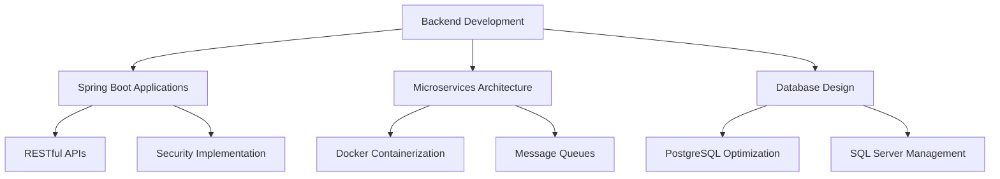

# 👋 Hello! I'm Nguyen Pham Minh Tri - Backend Java Developer

<div align="center">
  
</div>

## 🚀 About Me

```java
public class BackendDeveloper {
    private String name = "Nguyen Pham Minh Tri";
    private String role = "Backend Java Developer";
    private String[] expertise = {"Spring Boot", "Microservices", "RESTful APIs"};
    private String[] currentFocus = {"Clean Architecture", "System Design", "Performance Optimization"};
    
    public void sayHi() {
        System.out.println("Welcome to my profile! 🎯");
        System.out.println("I'm passionate about building robust and scalable backend systems");
    }
}
```

## 🛠️ Tech Stack

### 💻 Languages & Frameworks
<div align="center">
  


</div>

### 🗄️ Databases
<div align="center">
  


</div>

### 🔧 Tools & Technologies
<div align="center">
  


</div>

### 📊 Project Management & Version Control
<div align="center">
  


</div>

## 🏗️ Architecture Expertise

<div align="center">
  
| 🔧 **Backend Specialization** | 📈 **System Design** |
|:---:|:---:|
| ⚡ **Microservices Architecture** | 📊 **Scalable Systems** |
| 🌐 **RESTful API Design** | 🔄 **Event-Driven Architecture** |
| 🐳 **Containerization (Docker)** | 📮 **Message Queues (RabbitMQ)** |
| 🗄️ **Database Design & Optimization** | 🔒 **Security Best Practices** |

</div>

## 📈 GitHub Stats

<div align="center">
  


</div>

## 🔥 GitHub Streak

<div align="center">
  


</div>

## 🎯 What I'm Currently Working On

- 🔨 Building robust **Spring Boot microservices**
- 📚 Exploring **Clean Architecture** patterns  
- 🚀 Optimizing **database performance**
- 🌱 Learning **distributed systems** design
- 💡 Contributing to **open-source** projects

## 💼 Professional Focus



## 🌟 Key Highlights

- 🎯 **Backend Specialist**: Expert in Java Spring Boot backend development
- 🏗️ **Architecture**: Experienced in microservices and clean architecture design
- 📊 **Performance**: Database and API performance optimization expert
- 🔧 **DevOps**: Proficient with Docker containerization and deployment
- 🤝 **Collaboration**: Effective team collaboration using Git/GitHub workflows

## 🚀 Areas of Expertise

### Backend Development
- **Java Spring Boot** - Building enterprise-grade applications
- **RESTful APIs** - Designing clean and efficient web services
- **Microservices** - Scalable distributed system architecture
- **Client-Server** - Full-stack communication patterns

### Database Management
- **PostgreSQL** - Advanced querying and optimization
- **SQL Server** - Enterprise database solutions
- **Database Design** - Normalized and performant schemas

### DevOps & Tools
- **Docker** - Containerization and deployment
- **RabbitMQ** - Message queue implementation
- **Git/GitHub** - Version control and collaboration

## 📫 Let's Connect

<div align="center">
  
[](https://linkedin.com/in/yourprofile)
[](mailto:your.email@gmail.com)
[](https://github.com/yourusername)

</div>

---

<div align="center">
  
**💡 "Write clean code, design robust systems, and never stop learning new technologies!"**


</div>

---

⭐ **Fun Fact**: I believe good code doesn't just work - it should be readable, maintainable, and scalable!

<div align="center">
  
</div>

## 💻 Code Philosophy

```java
// My approach to backend development
public class DevelopmentPhilosophy {
    
    public String[] principles = {
        "Clean, readable, and maintainable code",
        "Performance optimization without sacrificing clarity",  
        "Comprehensive testing and documentation",
        "Scalable and fault-tolerant system design"
    };
    
    public void buildSoftware() {
        // Always think about scalability from day one
        // Write code that your future self will thank you for
        // Test early, test often, refactor continuously
    }
}
```
